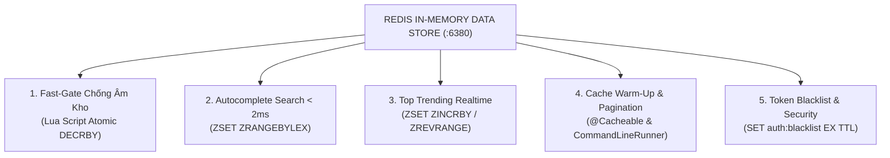

# 🚀 HỆ THỐNG THƯƠNG MẠI ĐIỆN TỬ FLASHSALE KIẾN TRÚC MICROSERVICES
> **Tài liệu Báo cáo Kỹ thuật & Sơ đồ Vận hành Kafka, Redis, Microservices**  
> *Dự án: FlashDeal Enterprise High-Throughput E-Commerce Platform*

---

## 📑 MỤC LỤC
1. [Tổng quan Kiến trúc Hệ thống (System Architecture)](#1-tổng-quan-kiến-trúc-hệ-thống)
2. [Chi tiết 5 Microservices & Trách nhiệm Nghiệp vụ](#2-chi-tiết-5-microservices--trách-nhiệm-nghiệp-vụ)
3. [Bản đồ Ứng dụng Redis Toàn diện (5 Kỹ thuật Cốt lõi)](#3-bản-đồ-ứng-dụng-redis-toàn-diện)
4. [Bản đồ Ứng dụng Apache Kafka (Event-Driven Architecture)](#4-bản-đồ-ứng-dụng-apache-kafka)
5. [Luồng Xử lý Đặt hàng Flash Sale Đỉnh tải (50.000 req/s)](#5-luồng-xử-lý-đặt-hàng-flash-sale-đỉnh-tải)
6. [Danh mục Tính năng & Ma trận Công nghệ (Feature Matrix)](#6-danh-mục-tính-năng--ma-trận-công-nghệ)
7. [Hướng dẫn Khởi chạy & Kiểm thử Hạ tầng](#7-hướng-dẫn-khởi-chạy--kiểm-thử-hạ-tầng)

---

# 1. TỔNG QUAN KIẾN TRÚC HỆ THỐNG

Hệ thống được xây dựng theo mô hình **Microservices hướng sự kiện (Event-Driven Microservices Architecture)**, áp dụng nguyên tắc **Database-per-Service (Mỗi service sở hữu cơ sở dữ liệu độc lập)**, triệt tiêu phụ thuộc trực tiếp (Decoupling) và chịu tải cao thông qua **Redis In-Memory** và **Apache Kafka Broker**.

```
                           ┌───────────────────────────────┐
                           │   React 19 Frontend (:5173)   │
                           │   (Vite + Tailwind CSS + Lucide)│
                           └───────────────┬───────────────┘
                                           │ HTTP / REST
                                           ▼
                           ┌───────────────────────────────┐
                           │   API GATEWAY SERVICE (:8080) │
                           │   (Spring Cloud Gateway, CORS)│
                           └───────┬───────┬───────┬───────┘
                                   │       │       │
              ┌────────────────────┘       │       └────────────────────┐
              ▼                            ▼                            ▼
   ┌──────────────────────┐     ┌──────────────────────┐     ┌──────────────────────┐
   │  AUTH SERVICE (:8081)│     │PRODUCT SERVICE (:8082│     │FLASHSALE-ORDER (:8083│
   │  • Stateless JWT     │     │• Product & Category  │     │• FlashSale Campaigns │
   │  • DB: auth_db       │     │• DB: product_db      │     │• DB: order_db        │
   │  • Redis: Blacklist  │     │• Redis: ZSET Search  │     │• Redis: Lua FastGate │
   └──────────┬───────────┘     └──────────┬───────────┘     └──────────┬───────────┘
              │ user.registered.event      │ product.events             │ flashsale.order.created
              │ (2 Partitions)             │ (3 Partitions)             │ (4 Partitions | Key: productId)
              └─────────────────────┐      │      ┌─────────────────────┘
                                    ▼      ▼      ▼
                        ┌─────────────────────────────────────┐
                        │   APACHE KAFKA BROKER (:9092)       │
                        │   (KRaft Mode - Distributed Log)    │
                        └──────────────────┬──────────────────┘
                                           │
                                           ▼
                                ┌──────────────────────┐
                                │ NOTIFICATION (:8086) │
                                │ • Email HTML Invoice │
                                │ • JavaMail + Thymeleaf│
                                └──────────────────────┘
```

---

# 2. CHI TIẾT 5 MICROSERVICES & TRÁCH NHIỆM NGHIỆP VỤ

| Service Name | Cổng (Port) | Cơ sở dữ liệu | Vai trò & Trách nhiệm chính |
| :--- | :---: | :--- | :--- |
| **API Gateway** | `8080` | Không dùng DB | • Cửa ngõ duy nhất tiếp nhận toàn bộ request từ Client.<br/>• Routing động đến các Microservices.<br/>• Xử lý CORS tập trung, bảo vệ backend.<br/>• Tích hợp Swagger OpenAPI Aggregator gom tài liệu API. |
| **Auth Service** | `8081` | PostgreSQL (`auth_db`) | • Đăng ký, Đăng nhập, Cấp phát Token HMAC-SHA256.<br/>• Phân quyền RBAC (`ROLE_CUSTOMER`, `ROLE_ADMIN`).<br/>• Quản lý Refresh Token và Token Blacklist qua Redis. |
| **Product Service** | `8082` | PostgreSQL (`product_db`) | • Quản lý Danh mục (Categories) & Sản phẩm (Products).<br/>• Tìm kiếm Autocomplete tức thì `< 2ms` bằng Redis ZSET.<br/>• Bảng xếp hạng Top 10 từ khóa tìm kiếm hot thời gian thực.<br/>• Lọc sản phẩm đa tiêu chí (Giá, Danh mục, Tồn kho, Sắp xếp). |
| **FlashSale Order** | `8083` | PostgreSQL (`order_db`) | • Quản lý Chiến dịch Flash Sale & Khung giờ mở bán.<br/>• **Cổng chặn Fast-Gate Lua Script trên Redis**: Trừ kho RAM trong `1.5ms`, chống mua trùng và chống âm kho tuyệt đối.<br/>• Bắn `OrderCreatedEvent` vào Kafka với Partition Key là `productId`.<br/>• Consumer xử lý ghi đơn tuần tự vào DB và Scheduler tự động hủy đơn sau 15 phút. |
| **Notification** | `8086` | Không dùng DB | • Lắng nghe sự kiện `flashsale.order.created` từ Kafka.<br/>• Render giao diện hóa đơn đặt hàng bằng Thymeleaf Engine.<br/>• Gửi Email xác nhận kèm thời hạn thanh toán 15 phút qua Gmail SMTP. |

---

# 3. BẢN ĐỒ ỨNG DỤNG REDIS TOÀN DIỆN (5 KỸ THUẬT CỐT LÕI)

Trong hệ thống FlashDeal, Redis không chỉ đơn thuần là bộ nhớ Cache mà là **trung tâm điều phối hiệu năng cao** cho 5 bài toán chuyên sâu:



---

### 1️⃣ Cổng chặn Fast-Gate trừ kho bằng Lua Script nguyên tử (`< 1.5ms`)
* **Vị trí Code**: `flashdeal-api/flashsale-order-service/src/main/java/flashdeal_api/order/redis/StockDeductionLuaScript.java`
* **Vấn đề giải quyết**: Chặn đứng hiện tượng **Âm kho (Overselling)** và **Race Condition** khi 50.000 khách hàng cùng bấm mua 100 sản phẩm tại cùng 1 giây.
* **Nguyên lý hoạt động**:
  * Redis thực thi Lua Script **đơn luồng (Single-Threaded)**. Toàn bộ logic kiểm tra User mua trùng ➔ kiểm tra số lượng tồn ➔ trừ tồn kho được thực hiện **nguyên tử (Atomic)** trên RAM.
  ```lua
  -- KEYS[1]: Key tồn kho RAM (flashsale:stock:{campaignId}:{productId})
  -- KEYS[2]: Key chống mua trùng (flashsale:user:{campaignId}:{productId}:{userId})
  if redis.call('EXISTS', KEYS[2]) == 1 then return -2 end -- Chặn mua trùng
  local stock = tonumber(redis.call('GET', KEYS[1]))
  if not stock or stock < tonumber(ARGV[1]) then return -1 end -- Chặn hết hàng
  redis.call('DECRBY', KEYS[1], ARGV[1]) -- Trừ tồn kho RAM (< 1.5ms)
  redis.call('SET', KEYS[2], '1', 'EX', tonumber(ARGV[2])) -- Đánh dấu đã mua
  return 1 -- Đặt hàng thành công
  ```

---

### 2️⃣ Tìm kiếm gợi ý từ khóa tức thì (Search Autocomplete As-You-Type)
* **Vị trí Code**: `flashdeal-api/product-service/src/main/java/flashdeal_api/service/impl/RedisSearchServiceImpl.java`
* **Lệnh Redis**: `ZRANGEBYLEX search:suggestions [prefix [prefix\uffff LIMIT 0 10`
* **Cơ chế**:
  * Lưu trữ danh sách từ khóa vào Sorted Set (ZSET) với điểm `score = 0`.
  * Khi người dùng gõ từ khóa trên Frontend (ví dụ `ip`, `mac`), hệ thống truy vấn theo thứ tự từ điển Lexicographical trên RAM, trả về kết quả trong **`< 2ms`**, hoàn toàn không quét câu lệnh `LIKE '%...%'` xuống PostgreSQL.

---

### 3️⃣ Bảng xếp hạng Top 10 Từ khóa Hot nhất sàn (Top Trending Search)
* **Vị trí Code**: `flashdeal-api/product-service/src/main/java/flashdeal_api/service/impl/RedisSearchServiceImpl.java`
* **Lệnh Redis**:
  * Khi tìm kiếm: `ZINCRBY search:trending 1 "từ_khóa"` (Tự động tăng điểm +1 mỗi lần người dùng search).
  * Khi hiển thị: `ZREVRANGE search:trending 0 9 WITHSCORES` (Lấy ra Top 10 từ khóa có điểm cao nhất).

---

### 4️⃣ Cache Warm-Up & Tự động làm mới bộ nhớ đệm
* **Vị trí Code**: `flashdeal-api/product-service/src/main/java/flashdeal_api/runner/SearchWarmUpRunner.java`
* **Cơ chế**:
  * Khi `product-service` khởi động, `SearchWarmUpRunner` tự động nạp toàn bộ danh mục sản phẩm từ PostgreSQL vào Redis ZSET để tránh tình trạng **Cache Cold**.
  * Dùng `@Cacheable(value = "products", key = "#id")` và `@CacheEvict` để tự động làm mới bộ nhớ đệm khi có thao tác sửa/xóa sản phẩm.

---

### 5️⃣ Bảo mật Stateless Token Blacklist & Quản lý Phiên đăng nhập
* **Vị trí Code**: `flashdeal-api/auth-service/src/main/java/flashdeal_api/auth/service/impl/AuthServiceImpl.java`
* **Cơ chế**:
  * Khi người dùng Logout, Access Token được đưa vào Redis Blacklist: `SET auth:blacklist:{token} "LOGGED_OUT" EX {thời_gian_sống_còn_lại}`.
  * Khi có request gửi kèm token này, Gateway / Filter kiểm tra Redis Blacklist trong `0.5ms` và từ chối truy cập ngay lập tức.

---

# 4. BẢN ĐỒ ỨNG DỤNG APACHE KAFKA (EVENT-DRIVEN ARCHITECTURE)

Hệ thống sử dụng **Apache Kafka (KRaft mode)** gồm **3 Topics nghiệp vụ chuẩn** để giao tiếp bất đồng bộ:

```
[KAFKA BROKER CLUSTER :9092]
  ├── Topic 1: flashsale.order.created ────── (4 Partitions | Key: productId)
  │      ├─► Consumer 1: OrderCreatedConsumer (4 Luồng -> Lưu DB & Trừ kho SQL)
  │      └─► Consumer 2: OrderCreatedNotificationConsumer (Gửi Email HTML)
  │
  ├── Topic 2: product.events ─────────────── (3 Partitions | Key: productId)
  │      └─► Consumer: ProductEventConsumer (Đồng bộ tên/giá sang FlashSale Service)
  │
  └── Topic 3: user.registered.event ──────── (2 Partitions | Key: userId)
         └─► Consumer: Onboarding Event Consumer
```

---

### 📊 BẢNG CHI TIẾT 3 KAFKA TOPICS TRONG HỆ THỐNG

| Tên Topic | Partitions | Partition Key | Producer | Consumer & Nhóm Consumer | Mục đích & Ý nghĩa Kỹ thuật |
| :--- | :---: | :---: | :--- | :--- | :--- |
| **`flashsale.order.created`** | **4** | **`productId`** | `flashsale-order-service` | • `OrderCreatedConsumer`<br/>*(Group: `flashsale-order-group`)*<br/>• `OrderNotificationConsumer`<br/>*(Group: `notification-service-group`)* | **Core Flash Sale**: Sau khi Lua Script trừ kho RAM thành công, event được bắn vào topic. 4 luồng Consumer song song ghi nhận đơn vào DB `order_db` và kích hoạt gửi Email hóa đơn bất đồng bộ. |
| **`product.events`** | **3** | **`productId`** | `product-service` | • `ProductEventConsumer`<br/>*(Group: `order-product-events-group`)* | **Data Replication**: Khi Admin thêm/sửa/xóa sản phẩm ở Product Service, dữ liệu được đồng bộ sang Flash Sale Service mà **không cần gọi REST API đồng bộ**. |
| **`user.registered.event`** | **2** | **`userId`** | `auth-service` | • `Notification / Analytics Consumer` | **User Onboarding**: Bắn event khi có tài khoản mới đăng ký để kích hoạt luồng chào mừng và thống kê. |

---

### 🔑 2 ĐIỂM SÁNG KỸ THUẬT KAFKA ĂN ĐIỂM CAO:

#### 1. Đảm bảo thứ tự nghiêm ngặt (Strict FIFO Ordering) bằng Partition Key = `productId`
* **Vấn đề**: Nếu nhiều người cùng đặt mua `iPhone 16`, việc xử lý lộn xộn sẽ gây xung đột khóa dòng (Row-lock contention) trong Database.
* **Giải pháp**: Gán Partition Key là `String.valueOf(productId)`. Kafka băm `hash(productId) % 4 Partitions`, đảm bảo **toàn bộ đơn hàng của cùng 1 sản phẩm sẽ đi vào cùng 1 Partition**. Consumer xử lý tuần tự từng đơn theo đúng thứ tự thời gian đặt hàng (FIFO), **loại bỏ 100% Race Condition**.

#### 2. Tối ưu thông lượng xử lý đa luồng (`concurrency = "4"`)
* **Vị trí Code**: `flashdeal-api/flashsale-order-service/src/main/java/flashdeal_api/order/consumer/OrderCreatedConsumer.java`
* **Cơ chế**: Topic có 4 Partitions, Spring Kafka khởi tạo 4 Worker Threads độc lập. 4 sản phẩm Flash Sale khác nhau được ghi xuống Database đồng thời trên 4 luồng CPU riêng biệt.

---

# 5. LUỒNG XỬ LÝ ĐẶT HÀNG FLASHSALE ĐỈNH TẢI (50.000 REQ/S)

Toàn bộ quy trình diễn ra theo **3 giai đoạn khép kín**:

```
[50.000 Khách Hàng]
       │ (1) Bấm Săn Deal (POST /orders/place)
       ▼
[API Gateway :8080]
       │ (2) Chuyển tiếp Request
       ▼
[FlashSale Service :8083]
       │ (3) Gọi Lua Script trên Redis
       ▼
[REDIS FAST-GATE RAM] ────────► [-1 Hết hàng / -2 Mua trùng] ──► Chặn ngay tại RAM trong 1.5ms
       │
       │ (4) Trừ kho RAM thành công (+1)
       ▼
[KAFKA BROKER :9092] ─────────► Trả ngay HTTP 200 (Mã FS-..., Status PENDING ~10ms cho User)
       │
       ├───────────────────────────────────────────────┐
       ▼ (5a) Kafka Consumer (concurrency = 4)         ▼ (5b) Notification Consumer
[PostgreSQL Database (order_db)]              [JavaMail SMTP Service]
• Kiểm tra Idempotency chống trùng đơn         • Render HTML Hóa đơn Thymeleaf
• INSERT Order & OrderItem                     • Gửi Email hạn thanh toán 15 phút
• Cập nhật tồn kho SQL an toàn
```

### ⏰ Xử lý Hết hạn Đơn hàng sau 15 phút (Timeout Restock Scheduler):
* Mỗi đơn hàng Flash Sale có thời hạn thanh toán là 15 phút (`expiresAt = now + 15m`).
* **Scheduler ngầm** (`OrderTimeoutScheduler.java`) quét định kỳ các đơn quá hạn:
  * Chuyển trạng thái đơn sang `CANCELLED`.
  * Tự động **hoàn lại số lượng tồn kho (+1)** cho cả **Redis RAM (`INCRBY`)** và **PostgreSQL Database** để người khác có thể tiếp tục mua.

---

# 6. DANH MỤC TÍNH NĂNG & MA TRẬN CÔNG NGHỆ (FEATURE MATRIX)

| STT | Nhóm Tính Năng | Mô tả chi tiết | Công nghệ & Vị trí áp dụng |
| :---: | :--- | :--- | :--- |
| **1** | **Xác thực & Phân quyền** | Đăng ký, Đăng nhập, Phân quyền Admin / Customer, Token Rotation | • **JWT HMAC-SHA256** (Stateless)<br/>• **Redis**: Blacklist Access Token, Lưu Refresh Token |
| **2** | **Quản lý Sản phẩm & Danh mục** | CRUD Sản phẩm, Danh mục, Tải ảnh, Quản lý trạng thái ACTIVE/INACTIVE | • **PostgreSQL**: `product_db`<br/>• **Redis**: `@Cacheable`, `@CacheEvict`<br/>• **Kafka**: `product.events` |
| **3** | **Tìm kiếm Thông minh** | Autocomplete gợi ý từ khóa `< 2ms`, Bảng xếp hạng Top 10 xu hướng hot | • **Redis ZSET**: `ZRANGEBYLEX`<br/>• **Redis ZSET**: `ZINCRBY`, `ZREVRANGE` |
| **4** | **Chiến dịch Flash Sale** | Tạo chiến dịch, hẹn giờ mở bán, nạp cấu hình tồn kho Flash Sale | • **PostgreSQL**: `order_db`<br/>• **Redis Pre-heat**: Nạp trước tồn kho lên RAM |
| **5** | **Săn Deal Đỉnh tải** | Đặt hàng tốc độ cao, chống âm kho, chống mua trùng, phản hồi tức thì | • **Redis Lua Script**: Fast-Gate trừ kho RAM<br/>• **Kafka**: Topic `flashsale.order.created` (Key: `productId`) |
| **6** | **Xử lý Đơn hàng Bất đồng bộ** | Lưu đơn tuần tự, trừ kho DB an toàn, chống xử lý trùng (Idempotent) | • **Kafka Consumer**: `concurrency = 4`<br/>• **PostgreSQL**: Ràng buộc duy nhất `order_code` |
| **7** | **Thông báo & Email Hóa đơn** | Gửi email hóa đơn HTML chuyên nghiệp kèm mã đơn và hạn 15 phút | • **Kafka Consumer** (Notification Service)<br/>• **Thymeleaf Engine** + **Spring Mail (Gmail SMTP)** |
| **8** | **Hủy đơn & Hoàn kho tự động** | Quét đơn quá hạn 15 phút chưa thanh toán, tự động cộng hoàn tồn kho | • **Spring Scheduled Cron**<br/>• **Redis + DB Restock Mechanism** |
| **9** | **Frontend SPA Hiện đại** | Giao diện React 19, Tailwind CSS, Tìm kiếm tức thì, Đếm ngược Flash Sale | • **React 19**, **Vite**, **Axios Client**, **Lucide Icons** |

---

# 7. HƯỚNG DẪN KHỞI CHẠY & KIỂM THỬ HẠ TẦNG

### 🔹 Bước 1: Đóng gói và Khởi chạy toàn bộ bằng Docker

```powershell
# 1. Di chuyển vào thư mục backend
cd d:\spring\flashdeal\flashdeal-api

# 2. Build 5 file JAR siêu nhẹ ở máy ngoài (~15s)
.\mvnw clean package -DskipTests

# 3. Khởi chạy toàn bộ hệ sinh thái Microservices
docker compose up -d --build
```

### 🔹 Bước 2: Khởi chạy Frontend React 19

```powershell
cd d:\spring\flashdeal\flashdeal-fe
npm run dev
```

### 🔹 Bước 3: Các cổng truy cập kiểm thử và giám sát

* **Frontend Web Application**: [http://localhost:5173](http://localhost:5173)
* **Kafka-UI Dashboard (Giám sát Topics & Messages)**: [http://localhost:8085](http://localhost:8085)
* **API Gateway Documentation**: [http://localhost:8080/swagger-ui.html](http://localhost:8080/swagger-ui.html)
* **Tài khoản Quản trị viên (Admin)**: `admin@flashdeal.vn` / `Admin@123`
* **Tài khoản Khách hàng (Customer)**: `customer@flashdeal.vn` / `Password@123`

---
*Tài liệu được cập nhật chính xác theo mã nguồn dự án FlashDeal Enterprise.*
