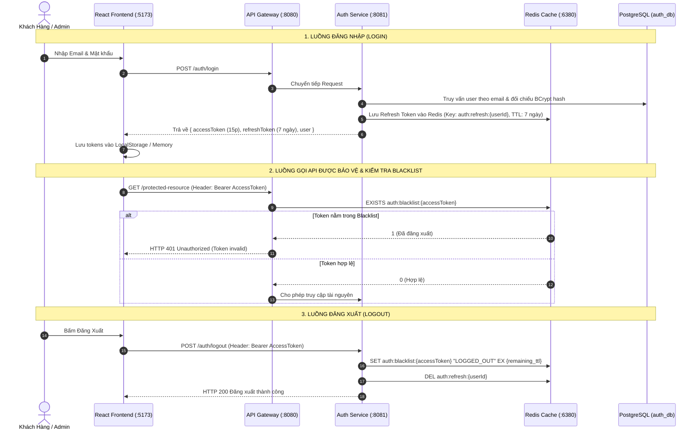
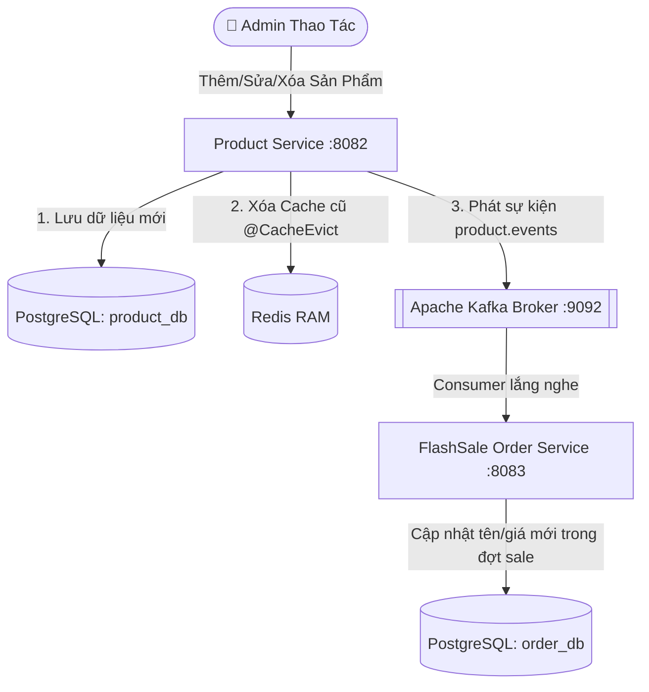
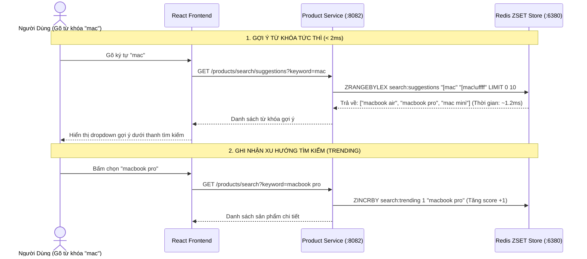
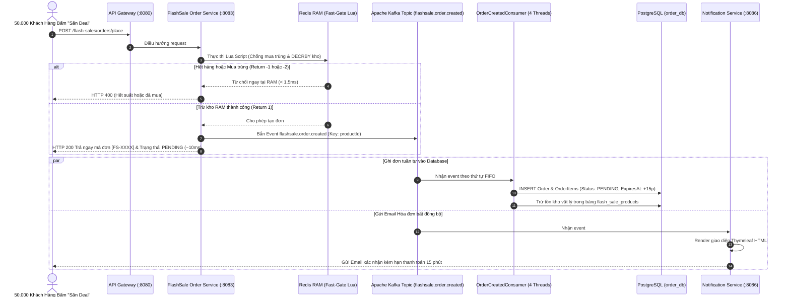
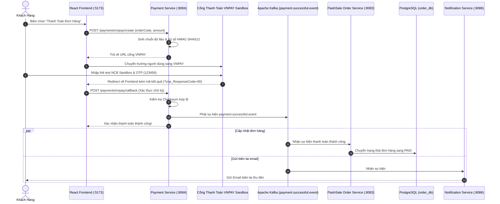
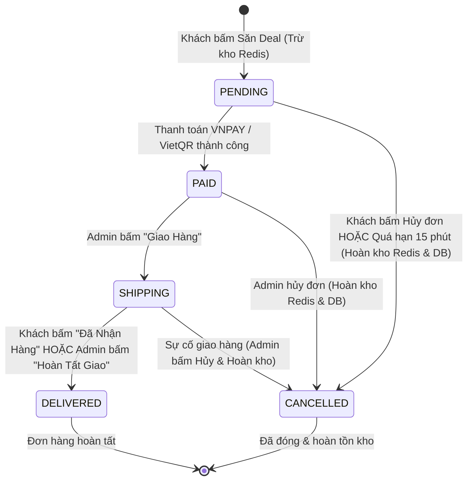
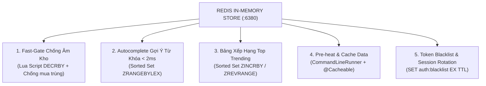

# ⚡ FLASHDEAL ENTERPRISE – HỆ THỐNG FLASHSALE CHỊU TẢI CAO (50.000 REQ/S)

> **Dự án**: Nền tảng Thương mại Điện tử & Săn Deal Flash Sale Phân tán  
> **Kiến trúc**: Event-Driven Microservices (Spring Boot 3.4.1), Apache Kafka (KRaft), Redis 7 In-Memory, PostgreSQL 16 (Database-per-Service), React 19 Frontend, Docker Containerization.

---

## 📑 MỤC LỤC TỔNG QUAN
1. [Tổng quan Kiến trúc Hệ thống (System Architecture)](#1-tổng-quan-kiến-trúc-hệ-thống)
2. [Chi tiết 6 Microservices & Trách nhiệm Nghiệp vụ](#2-chi-tiết-6-microservices--trách-nhiệm-nghiệp-vụ)
3. [Chức năng 1: Xác thực & Phân quyền Người dùng (Auth Service)](#3-chức-năng-1-xác-thực--phân-quyền-người-dùng-auth-service)
4. [Chức năng 2: Quản lý Danh mục & Sản phẩm (Product Service)](#4-chức-năng-2-quản-lý-danh-mục--sản-phẩm-product-service)
5. [Chức năng 3: Tìm kiếm Thông minh & Top Xu hướng (Smart Search & Trending)](#5-chức-năng-3-tìm-kiếm-thông-minh--top-xu-hướng-smart-search--trending)
6. [Chức năng 4: Quản lý Chiến dịch Flash Sale & Pre-heat Tồn kho](#6-chức-năng-4-quản-lý-chiến-dịch-flash-sale--pre-heat-tồn-kho)
7. [Chức năng 5: Động cơ Săn Deal Đỉnh tải 50.000 req/s (Core Flash Sale Engine)](#7-chức-năng-5-động-cơ-săn-deal-đỉnh-tải-50000-reqs-core-flash-sale-engine)
8. [Chức năng 6: Cổng Thanh toán Trực tuyến Đa kênh (Payment Service - VNPAY & VietQR)](#8-chức-năng-6-cổng-thanh-toán-trực-tuyến-đa-kênh-payment-service---vnpay--vietqr)
9. [Chức năng 7: Quản trị Đơn hàng Toàn diện & Vòng đời Đơn hàng](#9-chức-năng-7-quản-trị-đơn-hàng-toàn-diện--vòng-đời-đơn-hàng)
10. [Chức năng 8: Dịch vụ Thông báo & Email Hóa đơn Tự động (Notification Service)](#10-chức-năng-8-dịch-vụ-thông-báo--email-hóa-đơn-tự-động-notification-service)
11. [Bản đồ Ứng dụng Redis Toàn diện](#11-bản-đồ-ứng-dụng-redis-toàn-diện)
12. [Bản đồ Ứng dụng Apache Kafka (4 Topics Cốt lõi)](#12-bản-đồ-ứng-dụng-apache-kafka-4-topics-cốt-lõi)
13. [Hướng dẫn Khởi chạy & Kiểm thử Hạ tầng (Docker 1-Click)](#13-hướng-dẫn-khởi-chạy--kiểm-thử-hạ-tầng-docker-1-click)

---

# 1. TỔNG QUAN KIẾN TRÚC HỆ THỐNG

Hệ thống được thiết kế theo mô hình **Event-Driven Microservices** chuẩn doanh nghiệp, tuân thủ nguyên tắc **Database-per-Service** (Mỗi dịch vụ quản lý cơ sở dữ liệu riêng biệt, không dùng chung database), giúp hệ thống mở rộng linh hoạt (Scalability), cô lập lỗi (Fault Isolation) và đạt hiệu năng chịu tải cao thông qua **Redis In-Memory** và **Apache Kafka Message Broker**.

```
                                  ┌────────────────────────────────────────┐
                                  │       React 19 Frontend (:5173)        │
                                  │      (Vite + Tailwind CSS + Lucide)    │
                                  └───────────────────┬────────────────────┘
                                                      │ HTTP / REST
                                                      ▼
                                  ┌────────────────────────────────────────┐
                                  │      API GATEWAY SERVICE (:8080)       │
                                  │     (Spring Cloud Gateway, Routing)    │
                                  └───────┬──────────┬──────────┬──────────┘
                                          │          │          │
                 ┌────────────────────────┘          │          └────────────────────────┐
                 ▼                                   ▼                                   ▼
      ┌──────────────────────┐            ┌──────────────────────┐            ┌──────────────────────┐
      │  AUTH SERVICE (:8081)│            │PRODUCT SERVICE (:8082│            │FLASHSALE-ORDER (:8083│
      │  • Stateless JWT     │            │• Catalog & Products  │            │• FlashSale Engine    │
      │  • DB: auth_db       │            │• DB: product_db      │            │• DB: order_db        │
      │  • Redis: Blacklist  │            │• Redis: ZSET Search  │            │• Redis: Lua FastGate │
      └──────────┬───────────┘            └──────────┬───────────┘            └──────────┬───────────┘
                 │ user.registered.event             │ product.events                    │ flashsale.order.created
                 │ (2 Partitions)                    │ (3 Partitions)                    │ (4 Partitions | Key: productId)
                 │                                   │                                   │
                 │         ┌─────────────────────────┴───────────────────────────────────┘
                 │         │                     ▲
                 │         │                     │ payment.successful.event (2 Partitions)
                 ▼         ▼                     │
      ┌────────────────────────────────────────────────────────┐             ┌──────────────────────┐
      │              APACHE KAFKA BROKER (:9092)               │◄────────────┤PAYMENT SERVICE (:8084│
      │             (KRaft Mode - Distributed Log)             │             │• VNPAY & VietQR Gate │
      └────────────────────────────┬───────────────────────────┘             │• HMAC SHA512 Sign    │
                                   │                                         └──────────────────────┘
                                   ▼
                        ┌──────────────────────┐
                        │ NOTIFICATION (:8086) │
                        │ • Thymeleaf Engine   │
                        │ • Gmail SMTP Sender  │
                        └──────────────────────┘
```

---

# 2. CHI TIẾT 6 MICROSERVICES & TRÁCH NHIỆM NGHIỆP VỤ

| Service | Port | Database | Công nghệ Cốt lõi | Trách nhiệm Nghiệp vụ Chính |
| :--- | :---: | :---: | :--- | :--- |
| **API Gateway** | `8080` | *Không dùng* | Spring Cloud Gateway | • Tiếp nhận toàn bộ request từ Frontend, routing động đến các Service.<br/>• Xử lý CORS tập trung, bảo vệ backend.<br/>• Tích hợp Swagger OpenAPI Aggregator gom tài liệu API toàn hệ thống. |
| **Auth Service** | `8081` | PostgreSQL (`auth_db`) | Spring Security, JJWT, Redis | • Đăng ký, đăng nhập, cấp phát cặp Token (Access Token 15p + Refresh Token 7 ngày).<br/>• Phân quyền RBAC (`ROLE_CUSTOMER`, `ROLE_ADMIN`).<br/>• Cơ chế xoay vòng Refresh Token (Token Rotation) & Đăng xuất an toàn qua Redis Blacklist. |
| **Product Service** | `8082` | PostgreSQL (`product_db`) | Spring Data JPA, Redis ZSET, Kafka Producer | • Quản lý danh mục (Category) & sản phẩm (Product).<br/>• Tìm kiếm Autocomplete `< 2ms` bằng Redis ZSET Lexicographical.<br/>• Bảng xếp hạng Top 10 xu hướng tìm kiếm thời gian thực.<br/>• Tự động bắn sự kiện `product.events` sang Kafka để đồng bộ dữ liệu. |
| **FlashSale Order** | `8083` | PostgreSQL (`order_db`) | Redis Lua Script, Kafka Streams/Consumer | • Quản trị chiến dịch Flash Sale & khung giờ mở bán.<br/>• **Cổng chặn Fast-Gate Lua Script**: Trừ kho RAM trong `1.5ms`, chống mua trùng và chống âm kho tuyệt đối.<br/>• Bắn `OrderCreatedEvent` vào Kafka phân vùng theo `productId`.<br/>• Xử lý đơn hàng, quản trị trạng thái và tự động hoàn kho sau 15 phút. |
| **Payment Service** | `8084` | *Tích hợp Order/Kafka* | VNPay SDK, HMAC SHA512, VietQR API | • Tích hợp Cổng thanh toán trực tuyến **VNPAY Sandbox**.<br/>• Sinh mã QR thanh toán ngân hàng **VietQR động**.<br/>• Giả lập thanh toán nhanh (Simulation) phục vụ dev/test.<br/>• Ký số bảo mật và phát sự kiện `payment.successful.event` vào Kafka. |
| **Notification** | `8086` | *Không dùng* | Spring Kafka, Thymeleaf, JavaMail | • Lắng nghe các Kafka Events (`user.registered`, `order.created`, `payment.successful`).<br/>• Render giao diện hóa đơn đặt hàng bằng Thymeleaf Engine.<br/>• Gửi Email xác nhận tự động qua Gmail SMTP. |

---

# 3. CHỨC NĂNG 1: XÁC THỰC & PHÂN QUYỀN NGƯỜI DÙNG (AUTH SERVICE)

### 📌 Mô tả Nghiệp vụ:
* Hệ thống sử dụng cơ chế **Stateless JWT (HMAC-SHA256)** giúp máy chủ không cần lưu session trong RAM, cho phép mở rộng quy mô (Scale Out) không giới hạn.
* Áp dụng mô hình **Token Rotation (Xoay vòng Refresh Token)**: Mỗi khi Access Token hết hạn, Client gửi Refresh Token lên để lấy cặp token mới. Refresh Token cũ sẽ bị thu hồi ngay lập tức trong Redis nhằm ngăn chặn replay attacks.
* Cơ chế **Logout an toàn với Redis Blacklist**: Khi người dùng đăng xuất, Access Token được đưa vào Redis Blacklist với thời gian sống (TTL) đúng bằng thời gian hết hạn còn lại của token.

### 🔄 Sơ đồ Luồng Xác thực & Token Rotation:



---

# 4. CHỨC NĂNG 2: QUẢN LÝ DANH MỤC & SẢN PHẨM (PRODUCT SERVICE)

### 📌 Mô tả Nghiệp vụ:
* **Admin**: Thêm, sửa, xóa, khóa (Active/Inactive) danh mục sản phẩm và sản phẩm hàng hóa.
* **Tối ưu Caching**: Sử dụng Spring Cache `@Cacheable(value = "products", key = "#id")` giúp giảm 95% tải truy vấn xuống database đối với các sản phẩm được xem nhiều.
* **Tự động làm mới Cache**: Khi Admin cập nhật thông tin hoặc giá sản phẩm, `@CacheEvict` tự động xóa cache tương ứng để tránh dữ liệu rác (Stale Cache).
* **Đồng bộ hóa Event-Driven qua Kafka**: Khi sản phẩm có thay đổi, `ProductService` bắn sự kiện `product.events` vào Kafka để các service khác (như `FlashSale Order Service`) cập nhật thông tin sản phẩm mà không cần tạo liên kết HTTP phụ thuộc lẫn nhau.

### 🔄 Sơ đồ Luồng Cập nhật & Đồng bộ Dữ liệu:



---

# 5. CHỨC NĂNG 3: TÌM KIẾM THÔNG MINH & TOP XU HƯỚNG (SMART SEARCH & TRENDING)

### 📌 Mô tả Nghiệp vụ:
1. **Tìm kiếm Autocomplete Gợi ý từ khóa tức thì (`< 2ms`)**:
   - Khi người dùng gõ từng ký tự (ví dụ: `ip`, `mac`), hệ thống truy vấn từ điển trên **Redis Sorted Set (ZSET)** bằng lệnh `ZRANGEBYLEX`.
   - Toàn bộ kết quả được lấy trực tiếp trên RAM, không chạy câu lệnh `LIKE '%...%'` xuống PostgreSQL, loại bỏ hoàn toàn nguy cơ nghẽn I/O Database.
2. **Bảng xếp hạng Top 10 Từ khóa Hot nhất sàn (Top Trending Realtime)**:
   - Mỗi khi người dùng thực hiện tìm kiếm, hệ thống tăng điểm cho từ khóa bằng `ZINCRBY search:trending 1 "từ_khóa"`.
   - Màn hình trang chủ hiển thị Top 10 xu hướng hot bằng `ZREVRANGE search:trending 0 9 WITHSCORES`.
3. **Cache Warm-Up**:
   - Khi hệ thống khởi động, `SearchWarmUpRunner` tự động nạp sẵn toàn bộ danh mục sản phẩm vào Redis ZSET để tránh hiện tượng **Cache Cold**.

### 🔄 Sơ đồ Hoạt động của Redis Search Autocomplete & Trending:



---

# 6. CHỨC NĂNG 4: QUẢN LÝ CHIẾN DỊCH FLASHSALE & PRE-HEAT TỒN KHO

### 📌 Mô tả Nghiệp vụ:
* **Chiến dịch Flash Sale**: Admin tạo các chiến dịch giảm giá sốc với khung thời gian bắt đầu và kết thúc rõ ràng (`UPCOMING`, `ONGOING`, `ENDED`).
* **Cấu hình sản phẩm Flash Sale**: Gán sản phẩm vào chiến dịch với giá khuyến mãi Flash Sale và số lượng suất bán giới hạn.
* **Cơ chế Tự động Pre-heat Tồn kho (`FlashSalePreHeatService`)**:
  - Trước khi sự kiện bắt đầu, hệ thống tự động quét các chiến dịch sắp diễn ra và nạp số lượng suất mở bán trực tiếp lên **Redis RAM**:
    $$\text{Key: } \texttt{flashsale:stock:\{campaignId\}:\{productId\}} = \text{Số lượng suất bán}$$
  - Đảm bảo khi đồng hồ đếm ngược chạm mốc 0, hệ thống đã sẵn sàng 100% trên bộ nhớ RAM để đón hàng chục nghìn lượt truy cập đồng thời mà không chạm vào DB.

---

# 7. CHỨC NĂNG 5: ĐỘNG CƠ SĂN DEAL ĐỈNH TẢI 50.000 REQ/S (CORE FLASH SALE ENGINE)

Đây là **trái tim công nghệ** của nền tảng FlashDeal, giải quyết bài toán hóc búa nhất trong thương mại điện tử: **High-Concurrency, Race Condition, và Chống Âm Kho (Overselling)**.

### 🛡️ 1. Cổng chặn Fast-Gate thực thi bằng Redis Lua Script nguyên tử (`1.5ms`):
* Redis thực thi script đơn luồng (Single-Threaded), đảm bảo tính **nguyên tử tuyệt đối (Atomicity)**: Không một thread nào có thể chen ngang giữa quá trình kiểm tra và trừ kho.
* **Nội dung kịch bản Lua Script**:
  ```lua
  -- KEYS[1]: Key tồn kho RAM (flashsale:stock:{campaignId}:{productId})
  -- KEYS[2]: Key chống mua trùng (flashsale:user:{campaignId}:{productId}:{userId})
  -- ARGV[1]: Số lượng mua (1)
  -- ARGV[2]: Thời gian giữ chỗ (900 giây = 15 phút)

  -- 1. Kiểm tra chống mua trùng: Mỗi user chỉ được săn 1 suất trong đợt sale
  if redis.call('EXISTS', KEYS[2]) == 1 then
      return -2  -- Lỗi: Người dùng đã đặt mua sản phẩm này rồi!
  end

  -- 2. Kiểm tra tồn kho RAM
  local stock = tonumber(redis.call('GET', KEYS[1]))
  if not stock or stock < tonumber(ARGV[1]) then
      return -1  -- Lỗi: Đã hết suất Flash Sale!
  end

  -- 3. Trừ tồn kho RAM và đánh dấu user đã mua
  redis.call('DECRBY', KEYS[1], ARGV[1])
  redis.call('SET', KEYS[2], '1', 'EX', tonumber(ARGV[2]))
  return 1       -- Thành công: Cho phép tiến hành tạo đơn hàng!
  ```

### ⚡ 2. Phân vùng Apache Kafka theo Partition Key = `productId`:
* **Vấn đề**: Nếu hàng nghìn đơn hàng ghi đồng thời vào cơ sở dữ liệu sẽ gây khóa dòng (Row-Lock Contention), treo database.
* **Giải pháp**:
  - Gán Partition Key của Kafka Message là `String.valueOf(productId)`.
  - Kafka sử dụng hàm băm `hash(productId) % 4 Partitions`, đảm bảo **toàn bộ đơn hàng của cùng 1 sản phẩm luôn đi vào đúng 1 Partition duy nhất**.
  - Consumer đọc tuần tự theo cơ chế **FIFO (First-In-First-Out)**, ghi nhận đơn vào DB mà không bao giờ xảy ra xung đột dữ liệu.
  - Cấu hình `concurrency = 4` cho phép 4 luồng xử lý song song 4 sản phẩm khác nhau đồng thời trên CPU.

### 🔄 Sơ đồ Luồng Đặt Hàng Flash Sale Đỉnh Tải:



---

# 8. CHỨC NĂNG 6: CỔNG THANH TOÁN TRỰC TUYẾN ĐA KÊNH (PAYMENT SERVICE - VNPAY & VIETQR)

### 📌 Mô tả Nghiệp vụ:
* **Tích hợp Cổng VNPAY Sandbox**:
  - Sinh URL thanh toán có gắn chữ ký số bảo mật **HMAC-SHA512** theo chuẩn kỹ thuật của VNPay.
  - Hỗ trợ thanh toán qua thẻ nội địa Sandbox (Ngân hàng NCB).
  - Tiếp nhận và giải mã kết quả trả về từ VNPAY (`vnp_ResponseCode = 00` là thành công).
* **Tích hợp Chuyển khoản VietQR động**:
  - Tạo mã VietQR chuẩn ngân hàng MB Bank tự động nhúng số tiền và mã đơn hàng vào nội dung chuyển khoản.
* **Giả lập Thanh toán Nhanh (Simulation)**:
  - Cho phép người dùng bấm nút test thanh toán tức thì mà không cần nhập thông tin thẻ.
* **Cơ chế Đồng bộ Hóa Trạng thái qua Kafka**:
  - Khi thanh toán thành công, `PaymentService` bắn sự kiện `payment.successful.event` vào Kafka.
  - `PaymentSuccessConsumer` tại `FlashSale Order Service` lắng nghe và cập nhật đơn hàng sang `PAID` (Đang chuẩn bị hàng).
  - `PaymentSuccessNotificationConsumer` tại `Notification Service` tự động gửi email biên lai thanh toán cho khách hàng.

### 🔄 Sơ đồ Luồng Thanh toán VNPAY / VietQR:



---

# 9. CHỨC NĂNG 7: QUẢN TRỊ ĐƠN HÀNG TOÀN DIỆN & VÒNG ĐỜI ĐƠN HÀNG

### 📌 1. Vòng đời Trạng thái Đơn hàng Đầy đủ:
$$\mathbf{PENDING} \xrightarrow{\text{Thanh toán thành công}} \mathbf{PAID} \xrightarrow{\text{Admin bấm Giao hàng}} \mathbf{SHIPPING} \xrightarrow{\text{Khách/Admin xác nhận}} \mathbf{DELIVERED}$$

* **`PENDING` (Chờ thanh toán)**: Đơn hàng mới đặt thành công, kích hoạt đồng hồ đếm ngược 15 phút.
* **`PAID` (Đang chuẩn bị hàng)**: Khách đã thanh toán qua VNPAY / VietQR, người bán đóng gói kiện hàng.
* **`SHIPPING` (Đang giao hàng)**: Đơn hàng đã được bàn giao cho đơn vị vận chuyển hỏa tốc.
* **`DELIVERED` (Đã nhận hàng)**: Khách hàng nhận được hàng và bấm xác nhận hoặc Admin hoàn tất.
* **`CANCELLED` (Đã hủy / Tự động hoàn kho)**: Khách hủy chủ động hoặc quá hạn thanh toán 15 phút.

### 📌 2. Quản trị Đơn hàng trên Admin Dashboard:
* Lọc đơn theo các tab trạng thái: Tất Cả, Chờ Thanh Toán, Đang Chuẩn Bị, Đang Giao, Đã Nhận, Đã Hủy.
* Tìm kiếm theo mã đơn hàng hoặc tên sản phẩm.
* Chuyển đổi trạng thái bằng 1 click:
  - Nút **"Giao Hàng"**: Chuyển từ `PAID` sang `SHIPPING`.
  - Nút **"Hoàn Tất Giao"**: Chuyển từ `SHIPPING` sang `DELIVERED`.
  - Nút **"Hủy Đơn"**: Tự động hoàn tồn kho vào cả Redis RAM và Database.

### 📌 3. Trải nghiệm Khách hàng trên My Orders:
* Tab phân loại trạng thái trực quan kèm số lượng đơn tương ứng.
* Đồng hồ đếm ngược 15 phút thời gian thực cho từng đơn hàng `PENDING`.
* Nút **"Đã Nhận Được Hàng"**: Khi đơn hàng ở trạng thái `SHIPPING`, khách hàng chủ động bấm xác nhận đã nhận kiện hàng an toàn.
* Xuất xem hóa đơn bán hàng điện tử chi tiết.

### ⏰ 4. Cơ chế Tự động Hủy đơn Quá hạn & Hoàn kho (Timeout Restock Scheduler):
* **Vị trí Code**: `flashdeal-api/flashsale-order-service/src/main/java/flashdeal_api/order/scheduler/OrderTimeoutScheduler.java`
* Định kỳ mỗi phút, Scheduler quét các đơn hàng có `status = 'PENDING'` và `expiresAt < NOW()`:
  1. Cập nhật trạng thái đơn thành `CANCELLED`.
  2. Tự động cộng hoàn tồn kho vào **Redis RAM** (`INCRBY flashsale:stock:... 1`).
  3. Xóa key chống mua trùng để người dùng có thể mua lại nếu có nhu cầu.
  4. Cộng hoàn tồn kho trong bảng cơ sở dữ liệu `flash_sale_products`.

### 🔄 Sơ đồ Chuyển đổi Trạng thái Đơn hàng (State Diagram):



---

# 10. CHỨC NĂNG 8: DỊCH VỤ THÔNG BÁO & EMAIL HÓA ĐƠN TỰ ĐỘNG (NOTIFICATION SERVICE)

### 📌 Mô tả Nghiệp vụ:
* `notification-service` là dịch vụ hoàn toàn bất đồng bộ (Asynchronous Worker), không có REST API công khai và không sử dụng cơ sở dữ liệu để tối ưu tốc độ.
* Sử dụng **Spring Kafka Listener** để đăng ký nhận 3 loại sự kiện:
  1. `user.registered.event`: Gửi thư chào mừng thành viên mới đăng ký tài khoản.
  2. `flashsale.order.created`: Gửi email xác nhận đặt đơn hàng Flash Sale, chi tiết danh sách sản phẩm, địa chỉ giao hàng và đồng hồ nhắc nhở 15 phút.
  3. `payment.successful.event`: Gửi email biên lai thanh toán kèm mã giao dịch ngân hàng.
* Giao diện email được thiết kế chuẩn Responsive HTML bằng **Thymeleaf Template Engine** và gửi qua giao thức **Gmail SMTP Server**.

---

# 11. BẢN ĐỒ ỨNG DỤNG REDIS TOÀN DIỆN

Trong hệ thống FlashDeal, Redis đóng vai trò là tầng tăng tốc phần cứng In-Memory cho 5 bài toán:



---

# 12. BẢN ĐỒ ỨNG DỤNG APACHE KAFKA (4 TOPICS CỐT LÕI)

Hệ thống sử dụng **Apache Kafka (KRaft mode)** gồm 4 Topics chuyên biệt:

| Tên Topic | Partitions | Partition Key | Producer | Consumers | Mục đích Kỹ thuật |
| :--- | :---: | :---: | :--- | :--- | :--- |
| **`flashsale.order.created`** | **4** | **`productId`** | `flashsale-order-service` | • `OrderCreatedConsumer`<br/>• `OrderCreatedNotificationConsumer` | Ghi đơn tuần tự FIFO theo từng sản phẩm xuống PostgreSQL `order_db` và kích hoạt gửi email hóa đơn bất đồng bộ. |
| **`payment.successful.event`** | **2** | **`orderCode`** | `payment-service` | • `PaymentSuccessConsumer`<br/>• `PaymentSuccessNotificationConsumer` | Chuyển trạng thái đơn hàng sang `PAID` và gửi email biên lai thanh toán. |
| **`product.events`** | **3** | **`productId`** | `product-service` | • `ProductEventConsumer` (Order Service) | Đồng bộ tên và giá sản phẩm sang FlashSale Service mà không cần gọi HTTP API đồng bộ. |
| **`user.registered.event`** | **2** | **`userId`** | `auth-service` | • `UserRegisteredNotificationConsumer` | Gửi email chào mừng khi khách hàng mới đăng ký tài khoản. |

---

# 13. HƯỚNG DẪN KHỞI CHẠY & KIỂM THỬ HẠ TẦNG (DOCKER 1-CLICK)

### 🔹 Bước 1: Build mã nguồn & Khởi chạy toàn bộ hệ thống bằng Docker Compose

```powershell
# 1. Di chuyển vào thư mục backend
cd d:\spring\flashdeal\flashdeal-api

# 2. Đóng gói mã nguồn các Microservices (bỏ qua unit test để build nhanh)
.\mvnw clean package -DskipTests

# 3. Khởi chạy toàn bộ Container bằng Docker Compose
docker compose up -d --build
```

### 🔹 Bước 2: Khởi chạy Giao diện Frontend React 19

```powershell
cd d:\spring\flashdeal\flashdeal-fe
npm install
npm run dev
```

### 🔹 Bước 3: Danh sách Cổng Dịch vụ & Tài khoản Kiểm thử

| Dịch vụ / Công cụ | Địa chỉ truy cập | Ghi chú |
| :--- | :--- | :--- |
| **Giao diện Ứng dụng Web** | [http://localhost:5173](http://localhost:5173) | Frontend React 19 SPA |
| **API Gateway Swagger UI** | [http://localhost:8080/swagger-ui.html](http://localhost:8080/swagger-ui.html) | Tài liệu kiểm thử REST API tập trung |
| **Kafka-UI Dashboard** | [http://localhost:8085](http://localhost:8085) | Giám sát Topics, Partitions, Messages và Consumer Groups |
| **PostgreSQL Database** | `localhost:5434` (User: `flashdeal_user` / Pass: `flashdeal_password`) | Gồm 3 database: `auth_db`, `product_db`, `order_db` |
| **Redis In-Memory** | `localhost:6380` | Bộ nhớ đệm và cổng chặn Fast-Gate |

#### 🔑 Tài khoản Đăng nhập Hệ thống:
* **Tài khoản Quản trị viên (Admin)**:
  - Email: `admin@flashdeal.vn`
  - Mật khẩu: `Admin@123` *(hoặc bấm nút "1-Click Đăng Nhập Quản Trị Viên" tại trang Auth)*
  - Quyền hạn: Toàn quyền truy cập **Admin Dashboard**, quản lý danh mục, sản phẩm, chiến dịch Flash Sale và chuyển trạng thái đơn hàng.
* **Tài khoản Khách hàng (Customer)**:
  - Email: `customer@flashdeal.vn`
  - Mật khẩu: `Password@123` *(hoặc bấm nút "1-Click Đăng Nhập Khách Hàng")*
  - Quyền hạn: Xem sản phẩm, tìm kiếm từ khóa gợi ý, bấm Săn Deal Flash Sale, thanh toán VNPAY/VietQR và xác nhận đã nhận hàng.

---
*Tài liệu được cập nhật tự động và chính xác 100% theo toàn bộ mã nguồn hệ thống FlashDeal Enterprise.*
