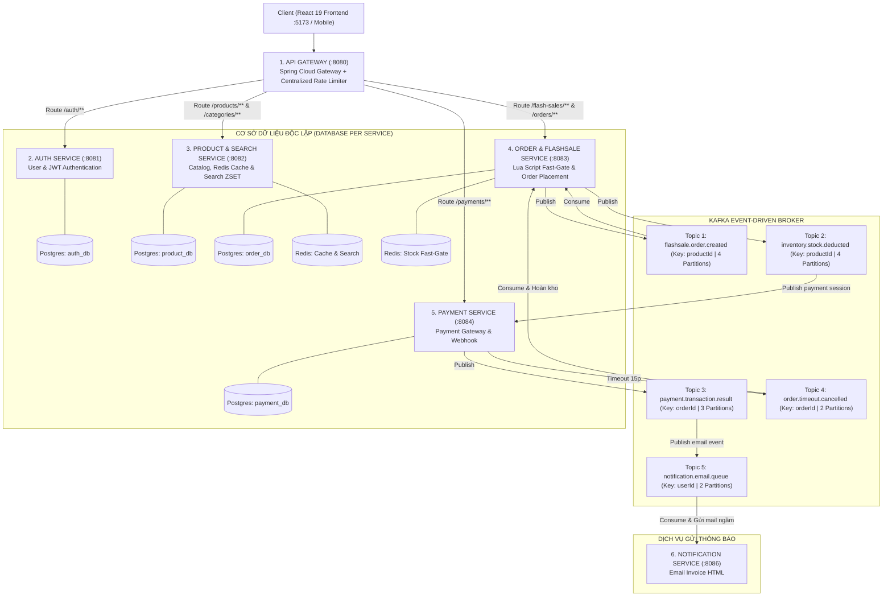
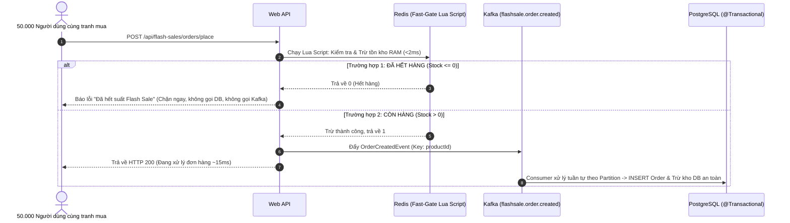

# 🚀 FLASHDEAL – HỆ THỐNG SĂN DEAL FLASH SALE & ĐẶT HÀNG PHÂN TÁN
> **High-Concurrency Event-Driven E-Commerce & Flash Sale Platform**  
> *Được xây dựng với: Java 21, Spring Boot 3.4.1, Apache Kafka (KRaft), Redis 7, PostgreSQL 16, React 19 (Vite) và Docker.*

---

## 📑 MỤC LỤC
1. [Tổng Quan Dự Án](#-1-tổng-quan-dự-án)
2. [Kiến Trúc Hệ Thống & Định Hướng Microservices](#-2-kiến-trúc-hệ-thống--định-hướng-microservices)
3. [Bảng Phân Bổ Kafka Topics & Partitions](#-3-bảng-phân-bổ-kafka-topics--partitions)
4. [Danh Sách Tính Năng Theo Module](#-4-danh-sách-tính-năng-theo-module)
5. [Chi Tiết Hệ Thống Tìm Kiếm Redis Engine](#-5-chi-tiết-hệ-thống-tìm-kiếm-redis-engine)
6. [Cơ Chế Chống Âm Kho (Concurrency Guard)](#-6-cơ-chế-chống-âm-kho-concurrency-guard)
7. [Tiến Độ Dự Án & Kế Hoạch 6 Phase](#-7-tiến-độ-dự-án--kế-hoạch-6-phase)
8. [Giao Diện Frontend & Trải Nghiệm Người Dùng](#-8-giao-diện-frontend--trải-nghiệm-người-dùng)
9. [Hướng Dẫn Khởi Chạy Bằng Docker](#-9-hướng-dẫn-khởi-chạy-bằng-docker)

---

# 🌟 1. TỔNG QUAN DỰ ÁN

**FLASHDEAL** là hệ thống thương mại điện tử giải quyết bài toán tải cực lớn (**High Concurrency**): **50.000 người dùng cùng tranh mua 100 sản phẩm trong khung giờ 00:00 Flash Sale**. 

Hệ thống được thiết kế theo nguyên lý tách rời tải:
- **Tải Đọc (Read-Heavy - 90% Traffic)**: Do **Redis** đảm nhiệm (Cache bộ lọc sản phẩm, Autocomplete từ khóa khi đang gõ `<2ms`, Bảng xếp hạng Top Hot Search `<1ms`, Rate Limiting chống bot).
- **Tải Ghi (Write-Heavy - 10% Concurrency Hotspot)**: Do **Redis Lua Script** (Cổng chặn tồn kho tức thời) và **Apache Kafka** (Phân làn sự kiện theo Partitions) đảm nhiệm, giúp API phản hồi trong **`< 20ms`** mà **không bao giờ bị âm kho** và **không làm sập Database**.

---

# 🏛️ 2. KIẾN TRÚC HỆ THỐNG & ĐỊNH HƯỚNG MICROSERVICES

### 🔹 Sơ đồ Phân rã Microservices (Domain-Driven Design):



### 🔹 Bảng Phân Chia Trách Nhiệm Từng Service:

| STT | Tên Microservice | Cổng nội bộ | Trách nhiệm chính | Database / Storage |
| :---: | :--- | :---: | :--- | :--- |
| **1** | **`api-gateway`** | **8080** | Cổng vào duy nhất, điều hướng request, CORS tập trung, xác thực JWT & Rate Limiting. | Redis (Rate Limiter) |
| **2** | **`auth-service`** | **8081** | Quản lý User, Đăng ký, Đăng nhập, cấp phát JWT & Refresh Token Rotation. | `auth_db` (users, roles) |
| **3** | **`product-service`** | **8082** | Quản lý Category & Product CRUD, Redis Data Cache, Autocomplete `ZRANGEBYLEX`, Trending `ZINCRBY`. | `product_db` + Redis Search |
| **4** | **`flashsale-order-service`** | **8083** | Quản lý chiến dịch Flash Sale, Redis Lua Script Fast-Gate, bắn Kafka `flashsale.order.created` và xử lý đơn. | `order_db` + Redis Stock Guard |
| **5** | **`payment-service`** | **8084** | Tiếp nhận Webhook thanh toán (VNPay / Momo), đếm ngược 15 phút thanh toán. | `payment_db` |
| **6** | **`notification-service`** | **8086** | Lắng nghe topic `notification.email.queue`, render hóa đơn HTML và gửi qua SMTP ngầm. | Không dùng DB |

---

# 📨 3. BẢNG PHÂN BỔ KAFKA TOPICS & PARTITIONS

| STT | Tên Topic | Nghiệp vụ chính | Partition Key | Số Partitions | Giải thích thiết kế |
| :---: | :--- | :--- | :---: | :---: | :--- |
| **1** | **`flashsale.order.created`** | Tiếp nhận yêu cầu đặt hàng Flash Sale | **`productId`** | **4** | **Đảm bảo thứ tự nghiêm ngặt (Strict Ordering)**: Mọi đơn hàng của cùng 1 sản phẩm `iPhone 16` đều vào chung 1 Partition ➡️ Trừ kho tuần tự, **triệt tiêu 100% nguy cơ âm kho**. |
| **2** | **`inventory.stock.deducted`** | Xác nhận trừ kho DB thành công | **`productId`** | **4** | Chuyển tiếp đơn hàng sang bước tạo phiên thanh toán. |
| **3** | **`payment.transaction.result`** | Kết quả thanh toán (Thành công / Thất bại) | **`orderId`** | **3** | Điều phối trạng thái đơn hàng sang `PAID` hoặc `PAYMENT_FAILED`. |
| **4** | **`order.timeout.cancelled`** | Hủy đơn sau 15 phút chưa thanh toán | **`orderId`** | **2** | Kích hoạt Consumer tự động cộng hoàn lại tồn kho (Restock). |
| **5** | **`notification.email.queue`** | Hàng đợi gửi Email hóa đơn & xác nhận | **`userId`** | **2** | Xử lý gửi mail bất đồng bộ ngầm dưới nền qua SMTP. |
| **6** | **`analytics.search.keywords`** | Thu thập từ khóa tìm kiếm thời gian thực | **`keyword`** | **2** | Phục vụ tính điểm Top Hot Search trên Redis. |

---

# 📦 4. DANH SÁCH TÍNH NĂNG THEO MODULE

### 🔹 Module 1: Xác Thực & Phân Quyền (Auth & Security)
- Đăng ký tài khoản (`POST /auth/register`): Mã hóa mật khẩu BCrypt.
- Đăng nhập (`POST /auth/login`): Cấp Access Token + Refresh Token (JWT).
- Cấp lại Token (`POST /auth/refresh-token`): Cơ chế Refresh Token Rotation an toàn.
- Phân quyền theo vai trò 2 lớp (Gateway + `@PreAuthorize("hasRole('ADMIN')")`).

### 🔹 Module 2: Quản Lý Sản Phẩm & Danh Mục (Product Catalog)
- Quản lý danh mục đa cấp (Category): CRUD, sinh slug chuẩn SEO, Cache Redis.
- Quản lý sản phẩm (Product): Tên, giá gốc, số lượng tồn kho tổng, mô tả, hình ảnh.
- Lọc sản phẩm đa tiêu chí với phân trang `PageResponse<T>` và Cache Key linh hoạt.
- Tự động nạp từ khóa vào Redis Search Index khi thêm/sửa sản phẩm.

### 🔹 Module 3: Quản Lý Chiến Dịch Flash Sale (Campaigns)
- Tạo chiến dịch Flash Sale (`POST /flash-sales`): Thời gian bắt đầu, kết thúc, trạng thái (`UPCOMING`, `HAPPENING`, `ENDED`).
- Thêm sản phẩm vào đợt Flash Sale: Giá giảm sốc (`flashSalePrice`), số lượng mở bán giới hạn (`saleQuantity`).
- Cơ chế Pre-heat Stock: Nạp sẵn số lượng tồn vào Redis trước giờ mở bán 5 phút.

### 🔹 Module 4: Đặt Hàng Flash Sale Siêu Tốc (Core Concurrency)
- Cổng chặn Fast-Gate với **Redis Lua Script**: Trừ tồn kho nguyên tử trên RAM trong **`< 2ms`**.
- Đẩy sự kiện vào Kafka `flashsale.order.created` (gán Partition Key theo `productId`).
- Trả về mã đơn hàng `orderId` và trạng thái `PENDING` ngay cho người mua (**~15ms**).
- `OrderConsumerGroup` (4 luồng song song) lưu `Order` + `OrderItem` vào PostgreSQL và trừ kho chính thức.

### 🔹 Module 5: Thanh Toán & Hủy Đơn Tự Động (Payment & Expiration)
- Tiếp nhận Webhook thanh toán (giả lập VNPay / Momo) ➡️ Bắn `PaymentResultEvent`.
- Đếm ngược 15 phút thanh toán qua Redis TTL: Nếu quá hạn ➡️ Bắn `OrderCancelledEvent`.
- `RestockConsumer` tự động cộng hoàn lại số lượng tồn kho vào cả Redis và PostgreSQL.

### 🔹 Module 6: Gửi Email Thông Báo Bất Đồng Bộ (Notification Engine)
- Consumer lắng nghe topic `notification.email.queue` ➡️ Render HTML hóa đơn chuyên nghiệp gửi qua SMTP ngầm dưới nền.

---

# 🔍 5. CHI TIẾT HỆ THỐNG TÌM KIẾM REDIS ENGINE

1. **Cache Dữ liệu Phân trang Đa tiêu chí**:
   - Cache kết quả lọc (*từ khóa, danh mục, khoảng giá, phân trang, sắp xếp*) qua DTO chuẩn `PageResponse<ProductResponse>` với `toCacheKey()`.
   - Tự động xóa cache (`@CacheEvict`) khi thông tin hoặc tồn kho sản phẩm thay đổi.
2. **Gợi ý từ khóa Autocomplete khi gõ (Search As-You-Type)**:
   - Dùng Redis Sorted Set (ZSET) với `rangeByLex` và dải từ điển `[prefix, prefix\uffff]` trả về danh sách gợi ý trong **`< 2ms`** mà không gọi xuống Database.
3. **Tự động làm ấm Cache (Cache Warm-Up)**:
   - Class `SearchWarmUpRunner` tự động quét danh sách sản phẩm `ACTIVE` trong Database và nạp sẵn vào Redis khi khởi động server.
4. **Bảng xếp hạng Top 10 Hot Search (Trending Leaderboard)**:
   - Khi người dùng tìm kiếm ➡️ Gọi `ZINCRBY search:trending 1 "keyword"`.
   - Lấy Top 10 xu hướng toàn sàn tức thì bằng `ZREVRANGE search:trending 0 9 WITHSCORES`.
5. **Search Rate Limiting (Chống bot cào dữ liệu)**:
   - Giới hạn mỗi IP tối đa 20 lượt search/phút bằng bộ đếm Redis.

---

# 🛡️ 6. CƠ CHẾ CHỐNG ÂM KHO (CONCURRENCY GUARD)



---

# 🗺️ 7. TIẾN ĐỘ DỰ ÁN & KẾ HOẠCH 6 PHASE

| Phase | Tên Phase | Trọng tâm công việc | Trạng thái chi tiết |
| :---: | :--- | :--- | :---: |
| **Phase 1** | **Hạ tầng Docker & Base Spring Boot 3** | Khởi chạy 5 container Docker (App, Postgres, Redis, Kafka, Kafka-UI), cấu hình Maven 3.4.1 và Security cơ bản. | ✅ **HOÀN THÀNH 100%** |
| **Phase 2** | **Mô hình Dữ liệu & Hệ thống Tìm kiếm Redis** | - CRUD Category & Product API chuẩn RESTful.<br/>- Redis Data Caching (`@Cacheable`, `@CacheEvict`, `PageResponse<T>`).<br/>- Autocomplete Search As-You-Type (`ZRANGEBYLEX` `<2ms`).<br/>- Tự động làm ấm Cache lúc khởi động (`SearchWarmUpRunner`).<br/>- Bảng xếp hạng Top 10 Hot Search (`ZINCRBY` & `ZREVRANGE`).<br/>- Bộ giới hạn tốc độ tìm kiếm (Rate Limiter 20 req/min/IP). | 🚀 **HOÀN THÀNH 90%**<br/>*(Đang hoàn thiện Rate Limiter)* |
| **Phase 3** | **Kiến trúc Kafka Topics, Partitions & Producers** | Viết `KafkaTopicConfig` (6 Topics & Partitions), Producer gán Partition Key chuẩn xác, định nghĩa Event DTOs. | ⏳ **TIẾP THEO** |
| **Phase 4** | **Core Flash Sale Concurrency & Trừ kho an toàn** | Redis Lua Script Fast-Gate, Topic `flashsale.order.created`, Order Consumer Group trừ kho DB an toàn không âm. | ⏳ Chờ triển khai |
| **Phase 5** | **Thanh toán, Hủy đơn tự động & Gửi Email** | Webhook Payment, Tự động hoàn kho sau 15p (Restock), Email Consumer gửi hóa đơn HTML qua SMTP. | ⏳ Chờ triển khai |
| **Phase 6** | **Tách Microservices, Load Test & Báo cáo** | Tách theo mô hình Microservices (Gateway, Auth, Product, Order), Concurrency Test 1.000 luồng tranh mua, đóng gói Dockerfile. | ⏳ Chờ triển khai |

---

# 💻 8. GIAO DIỆN FRONTEND & TRẢI NGHIỆM NGƯỜI DÙNG

Dự án đã được tích hợp sẵn ứng dụng Frontend React hoàn chỉnh tại thư mục `flashdeal-fe`:
* **Công nghệ**: React 19, Vite 8, Tailwind CSS 4, Axios, Lucide Icons.
* **Địa chỉ truy cập**: **[http://localhost:5173/](http://localhost:5173/)**
* **Các tính năng nổi bật**:
  - **Sàn TMĐT & Bộ lọc**: Tìm kiếm sản phẩm theo tên, danh mục, khoảng giá, sắp xếp theo giá/ngày tạo.
  - **Autocomplete Search Dropdown**: Gợi ý từ khóa tức thì khi đang gõ phím (`< 2ms` từ Redis ZSET).
  - **Thanh Xu hướng tìm kiếm (Trending Tags)**: Hiển thị các từ khóa hot nhất kèm số lượt tìm kiếm thời gian thực.
  - **Quản lý Sản phẩm & Danh mục**: Thêm, sửa, xóa, nút **Random Data** và **Seed Data mẫu** (10 sản phẩm & danh mục chỉ với 1 click).
  - **API Response Inspector Modal**: Xem trực tiếp cấu trúc JSON và mã phản hồi từ Backend.

---

# 🐳 9. HƯỚNG DẪN KHỞI CHẠY BẰNG DOCKER

Dự án được cấu hình **Zero-Dependency** (Máy tính không cần cài Java, Node hay PostgreSQL, chỉ cần Docker Desktop):

```bash
# 1. Khởi chạy toàn bộ hệ sinh thái (Postgres, Redis, Kafka, Kafka-UI, Backend App)
docker compose up -d --build

# 2. Khởi chạy Frontend React (tại thư mục flashdeal-fe)
npm run dev -- --port 5173

# 3. Xem logs ứng dụng
docker compose logs -f flashdeal-api

# 4. Dừng hệ thống
docker compose down
```

### 🌐 Địa chỉ truy cập các dịch vụ:
- **Frontend Web UI**: [http://localhost:5173/](http://localhost:5173/)
- **Swagger UI Documentation**: [http://localhost:8080/api/swagger-ui.html](http://localhost:8080/api/swagger-ui.html)
- **Kafka-UI Dashboard**: [http://localhost:8085](http://localhost:8085)
- **PostgreSQL Database**: `localhost:5434` (User: `flashdeal_user` / DB: `flashdeal_db`)
- **Redis Cache Server**: `localhost:6380`
